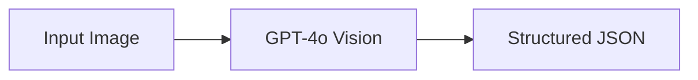
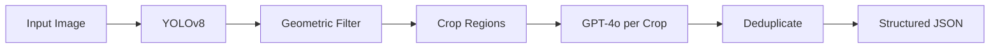
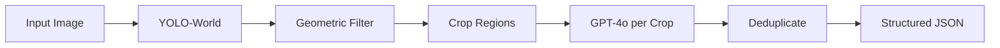
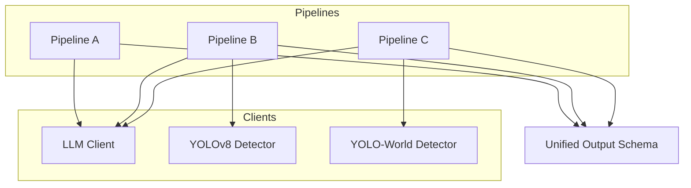
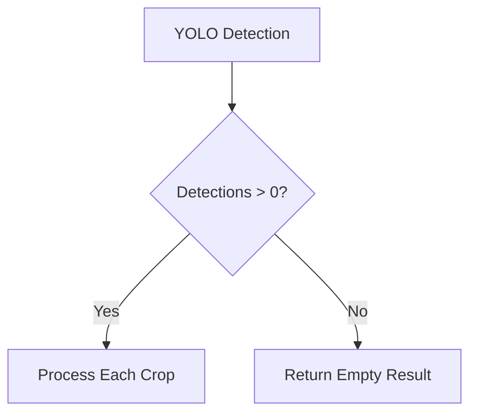
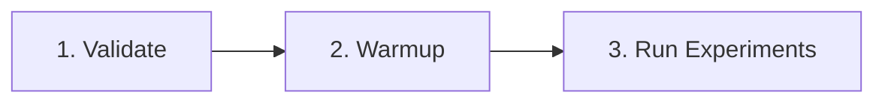

# SnapShelf

**A Comparative Study of Vision Pre-Processing Approaches for LLM-Based Food Recognition**

> **BSc Dissertation Artefact**
> Investigating the impact of structural and semantic visual pre-processing on Large Language Model performance in multi-item food recognition tasks.

## Abstract

This repository contains the experimental framework for evaluating three distinct pipelines for food item recognition from images. The study isolates the effect of visual pre-processing strategies on LLM classification accuracy, comparing:

- **(A)** Direct LLM inference on full images
- **(B)** Structurally-guided region proposals via class-agnostic object detection
- **(C)** Semantically-guided region proposals via open-vocabulary detection

## Table of Contents

1. [Research Context](#research-context)
2. [Pipeline Architecture](#pipeline-architecture)
3. [Experimental Design](#experimental-design)
4. [Installation](#installation)
5. [Usage](#usage)
6. [Output Schema](#output-schema)
7. [Configuration](#configuration)
8. [Reproducibility](#reproducibility)
9. [Project Structure](#project-structure)

## Research Context

### Problem Statement

Vision-Language Models (VLMs) demonstrate strong performance on single-object classification tasks but face challenges with multi-item scenes common in food recognition applications (e.g., refrigerator contents, grocery receipts, meal composition). This study investigates whether visual pre-processing—decomposing scenes into isolated regions—improves recognition accuracy, and whether the nature of that decomposition (structural vs. semantic) affects outcomes.

### Research Questions

1. Does region-based pre-processing improve LLM food recognition accuracy compared to full-image inference?
2. Does semantic guidance in region proposal (YOLO-World) outperform class-agnostic structural detection (YOLOv8)?
3. What is the trade-off between detection coverage and classification noise across approaches?

## Pipeline Architecture

The framework implements three parallel pipelines, each processing identical input images through different visual conditioning strategies before LLM classification.

### Pipeline Overview

| Pipeline | Pre-Processing | Detection Model | Semantic Guidance |
|:--------:|----------------|-----------------|:-----------------:|
| **A** | None | — | None |
| **B** | Class-agnostic detection | YOLOv8 (COCO) | None |
| **C** | Open-vocabulary detection | YOLO-World | Food-specific prompts |

### Pipeline A: LLM-Only Baseline



The baseline pipeline submits the complete image directly to the LLM with a structured prompt requesting food item identification. This approach relies entirely on the VLM's inherent multi-object recognition capabilities.

### Pipeline B: Structural Pre-Processing (Class-Agnostic YOLO)



Pipeline B employs standard YOLOv8 (trained on COCO) for region proposal, **deliberately ignoring class labels** to isolate structural contribution. Geometric filters remove noise without semantic reasoning.

**Key Characteristics:**
- Class labels discarded (all detections treated as generic "object")
- Geometric filtering: minimum 2% image area, aspect ratio between 0.2–5.0
- No semantic bias in region selection

### Pipeline C: Semantic Pre-Processing (YOLO-World)



Pipeline C uses YOLO-World's open-vocabulary capabilities with fixed food-specific prompts, providing semantic guidance during region proposal. Identical geometric filtering is applied for fair comparison with Pipeline B.

**Fixed Prompt Set:**
```python
["food", "fruit", "vegetable", "packaged food"]
```

**Key Characteristics:**
- Semantic prompts guide detection toward food-relevant regions
- Prompts are fixed (identical across all images, no dynamic adjustment)
- No specific food names to avoid biasing LLM classification
- Geometric filtering identical to Pipeline B

### System Components



| Component | File | Model |
|-----------|------|-------|
| LLM Client | `clients/llm_client.py` | `gpt-4o-mini` |
| Class-Agnostic Detector | `clients/yolo_detector_agnostic.py` | `yolov8s.pt` |
| YOLO-World Detector | `clients/yolo_detector.py` | `yolov8s-worldv2.pt` |

## Experimental Design

### Controlled Variables

To ensure experimental validity, the following parameters are held constant across all pipelines:

| Aspect | Value | Rationale |
|--------|:-----:|-----------|
| LLM Model | `gpt-4o-mini` | Identical classifier across pipelines |
| LLM Temperature | `0` | Deterministic outputs for reproducibility |
| LLM Prompts | Frozen | Eliminate prompt engineering as variable |
| Confidence Threshold | `0.15` | Identical sensitivity across YOLO variants |
| IoU Threshold | `0.45` | Identical NMS behaviour |
| Max Detections | `8` | Controlled region count |
| Crop Padding | `10%` | Identical context capture |
| Geometric Filters | Identical | Same constraints on Pipeline B and C |
| Random Seed | `42` | Reproducibility across runs |

### Fallback Policy

**Fallback is strictly disabled** for experimental fairness:



- If YOLO detects zero regions, returns empty result
- Does **not** fall back to full-image LLM analysis
- Ensures pipeline independence (Pipeline B/C results never contaminated by Pipeline A behaviour)

### Deduplication Strategy

Pipelines B and C aggregate multiple LLM responses (one per detected region). Results are deduplicated by normalised food name (case-insensitive) to prevent double-counting overlapping detections. Pipeline A does not require deduplication as the LLM sees the complete image once.

## Installation

### Prerequisites

- Python 3.10 or higher
- OpenAI API key with GPT-4o access
- ~50MB disk space for YOLO models

### Setup

```bash
# 1. Clone repository
git clone <repository-url>
cd SnapShelf-console

# 2. Create virtual environment
python -m venv venv

# Windows
venv\Scripts\activate

# macOS/Linux
source venv/bin/activate

# 3. Install dependencies
pip install -r requirements.txt

# 4. Configure environment
cp .env.example .env
# Edit .env and add your OpenAI API key:
# OPENAI_API_KEY=sk-...
```

YOLO models are downloaded automatically on first run.

## Usage

### Command-Line Interface

```bash
# Run individual pipelines
python main.py llm <image_path>          # Pipeline A: LLM-only
python main.py yolo <image_path>         # Pipeline B: Class-agnostic YOLO + LLM
python main.py yolo-world <image_path>   # Pipeline C: YOLO-World + LLM

# Utility commands
python main.py --validate                # Verify environment and display config
python main.py --warmup                  # Pre-load all models
```

### Interactive Mode

```bash
python main.py
```

Launches a menu-driven interface:

```
  1.  Pipeline A — LLM-only (baseline)
  2.  Pipeline B — Class-agnostic YOLO + LLM
  3.  Pipeline C — YOLO-World + LLM
  4.  Warmup models (for timing fairness)
  5.  Validate environment
  6.  Exit
```

### Recommended Experiment Workflow



```bash
# 1. Verify environment (API key, config display)
python main.py --validate

# 2. Pre-load models (excludes loading time from measurements)
python main.py --warmup

# 3. Run experiments (models already in memory)
python main.py llm image.jpg
python main.py yolo image.jpg
python main.py yolo-world image.jpg
```

**Why warmup matters:** Without warmup, the first run of each pipeline includes model loading time (~5 seconds). The warmup command pre-loads all models so timing measurements reflect only inference time, ensuring fair comparison.

## Output Schema

All pipelines produce an identical JSON structure for standardised comparison:

```json
{
  "items": [
    {"name": "apple", "state": "fresh"},
    {"name": "milk", "state": "packaged"},
    {"name": "bread", "state": "packaged"}
  ],
  "meta": {
    "pipeline": "yolo-world",
    "image": "refrigerator.jpg",
    "runtime_ms": 2847.32,
    "fallback_used": false,
    "detections_count": 5,
    "timing_breakdown": {
      "detection_ms": 342.15,
      "llm_total_ms": 2505.17,
      "llm_avg_ms": 501.03,
      "llm_calls": 5
    }
  }
}
```

### Item Fields

| Field | Type | Description |
|-------|:----:|-------------|
| `name` | string | Normalised food name (lowercase, generic) |
| `state` | enum | `fresh` · `packaged` · `cooked` · `unknown` |

### Metadata Fields

| Field | Type | Description |
|-------|:----:|-------------|
| `pipeline` | string | `llm` · `yolo` · `yolo-world` |
| `image` | string | Source image filename |
| `runtime_ms` | float | Total execution time in milliseconds |
| `fallback_used` | boolean | Always `false` (fallback disabled) |
| `detections_count` | integer | Number of YOLO detections (Pipeline B/C only) |
| `timing_breakdown` | object | Per-component timing for analysis |

### Timing Breakdown

| Field | Type | Description |
|-------|:----:|-------------|
| `image_load_ms` | float | Image loading time (Pipeline A) |
| `detection_ms` | float | YOLO inference time (Pipeline B/C) |
| `llm_total_ms` | float | Total LLM time across all crops |
| `llm_avg_ms` | float | Average LLM time per crop |
| `llm_calls` | integer | Number of LLM API calls made |

## Configuration

All experiment parameters are centralised in `config.py` as a frozen dataclass:

```python
@dataclass(frozen=True)
class ExperimentConfig:
    # LLM Settings
    llm_model: str = "gpt-4o-mini"
    llm_temperature: float = 0.0
    llm_image_detail: str = "high"
    llm_max_tokens_single: int = 150
    llm_max_tokens_multi: int = 500

    # YOLO Settings (identical for B and C)
    yolo_conf_threshold: float = 0.15
    yolo_iou_threshold: float = 0.45
    yolo_max_detections: int = 8
    yolo_crop_padding: float = 0.10

    # Geometric Filters (identical for B and C)
    min_bbox_area_pct: float = 0.02
    min_aspect_ratio: float = 0.2
    max_aspect_ratio: float = 5.0

    # YOLO-World Prompts (Pipeline C only)
    yolo_world_prompts: tuple = ("food", "fruit", "vegetable", "packaged food")

    # Reproducibility
    random_seed: int = 42
```

### Detection Parameters

| Parameter | Value | Description |
|-----------|:-----:|-------------|
| `CONF_THRESHOLD` | `0.15` | Minimum detection confidence |
| `IOU_THRESHOLD` | `0.45` | Non-Maximum Suppression overlap threshold |
| `MAX_DETECTIONS` | `8` | Maximum regions per image |
| `CROP_PADDING_PCT` | `0.10` | Padding around detected regions (10%) |

### Geometric Filters

Applied identically to both Pipeline B and C for fair comparison:

| Parameter | Value | Description |
|-----------|:-----:|-------------|
| `MIN_BBOX_AREA_PCT` | `0.02` | Minimum bounding box area (2% of image) |
| `MIN_ASPECT_RATIO` | `0.2` | Minimum width/height ratio |
| `MAX_ASPECT_RATIO` | `5.0` | Maximum width/height ratio |

## Reproducibility

### Singleton Pattern

All ML clients use a singleton pattern to ensure:
- Models are loaded once (not per-pipeline-call)
- Timing measurements exclude initialisation overhead
- Memory efficiency across multiple experiment runs

### Random Seed Control

Reproducibility seeds are set automatically on experiment initialisation:
- Python `random` module
- NumPy random state
- PyTorch (if available)

### Structured Logging

Every experiment run generates detailed logs in `logs/experiment_{timestamp}.jsonl`:

```json
{"timestamp": "2024-01-31T15:30:45", "pipeline": "yolo", "step": "detection", "details": {"bbox": {...}, "confidence": 0.87}}
{"timestamp": "2024-01-31T15:30:46", "pipeline": "yolo", "step": "llm_call", "duration_ms": 523.4, "raw_response": "..."}
```

Logs capture:
- Every YOLO detection (bounding box, confidence, filter pass/fail)
- Every LLM call (raw response, parsed result, timing)
- Pipeline completion summaries

### Pinned Dependencies

All dependencies are pinned to exact versions in `requirements.txt`:

```
ultralytics==8.3.57
openai==1.59.9
pillow==11.1.0
rich==13.9.4
python-dotenv==1.0.1
numpy==2.2.2
structlog==24.4.0
```

## Project Structure

```
SnapShelf-console/
│
├── main.py                           # CLI and interactive entry point
├── config.py                         # Frozen experiment configuration
├── requirements.txt                  # Pinned dependencies
├── .env.example                      # Environment template
│
├── clients/
│   ├── __init__.py
│   ├── llm_client.py                 # OpenAI Vision client (singleton)
│   ├── yolo_detector.py              # YOLO-World detector (Pipeline C)
│   └── yolo_detector_agnostic.py     # Class-agnostic detector (Pipeline B)
│
├── pipelines/
│   ├── __init__.py
│   ├── output.py                     # Unified output schema
│   ├── llm_pipeline.py               # Pipeline A implementation
│   ├── yolo_agnostic_pipeline.py     # Pipeline B implementation
│   └── yolo_world_pipeline.py        # Pipeline C implementation
│
└── logs/                             # Auto-generated experiment logs
```

## System Requirements

| Requirement | Specification |
|-------------|:-------------:|
| Python | 3.10+ |
| RAM | 4GB minimum (8GB recommended) |
| Disk | ~50MB (YOLO models) |
| Network | Required for OpenAI API |
| GPU | Optional (CPU supported) |

## License

This project is developed as part of a BSc dissertation.

## Acknowledgements

- [Ultralytics](https://github.com/ultralytics/ultralytics) for YOLOv8 and YOLO-World
- [OpenAI](https://openai.com) for GPT-4o Vision API
