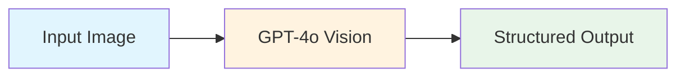
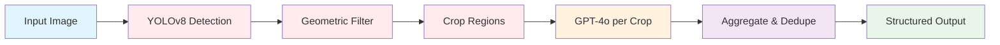
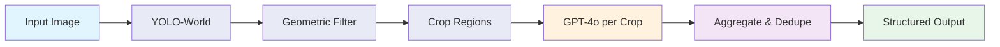
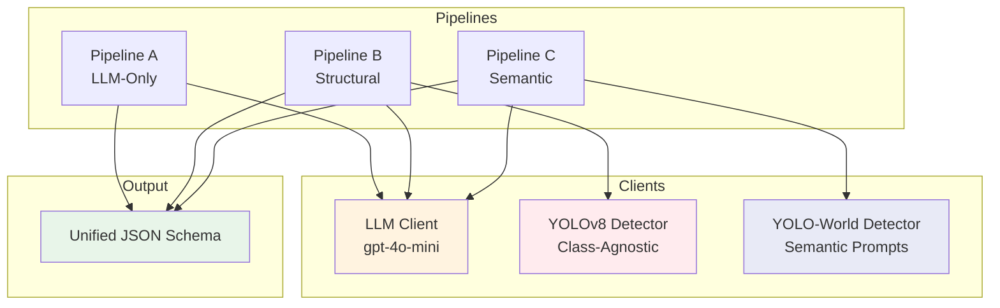
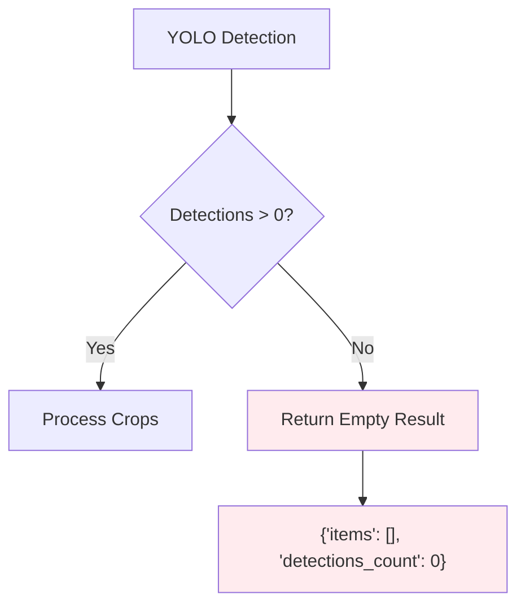
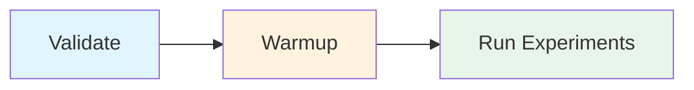

# SnapShelf

**A Comparative Study of Vision Pre-Processing Approaches for LLM-Based Food Recognition**

> **BSc Dissertation Artefact**
> Investigating the impact of structural and semantic visual pre-processing on Large Language Model performance in multi-item food recognition tasks.

## Abstract

This repository contains the experimental framework for evaluating three distinct pipelines for food item recognition from images. The study isolates the effect of visual pre-processing strategies on LLM classification accuracy, comparing:

- **(A)** Direct LLM inference on full images
- **(B)** Structurally-guided region proposals via class-agnostic object detection
- **(C)** Semantically-guided region proposals via open-vocabulary detection

## Table of Contents

- [Research Context](#research-context)
- [Pipeline Architecture](#pipeline-architecture)
- [Experimental Design](#experimental-design)
- [Installation](#installation)
- [Usage](#usage)
- [Output Schema](#output-schema)
- [Configuration](#configuration)
- [Reproducibility](#reproducibility)
- [Project Structure](#project-structure)
- [Requirements](#requirements)

## Research Context

### Problem Statement

Vision-Language Models (VLMs) demonstrate strong performance on single-object classification tasks but face challenges with multi-item scenes common in food recognition applications (e.g., refrigerator contents, grocery receipts, meal composition). This study investigates whether visual pre-processing—decomposing scenes into isolated regions—improves recognition accuracy, and whether the nature of that decomposition (structural vs. semantic) affects outcomes.

### Research Questions

1. Does region-based pre-processing improve LLM food recognition accuracy compared to full-image inference?
2. Does semantic guidance in region proposal (YOLO-World) outperform class-agnostic structural detection (YOLOv8)?
3. What is the trade-off between detection coverage and classification noise across approaches?

## Pipeline Architecture

The framework implements three parallel pipelines, each processing identical input images through different visual conditioning strategies before LLM classification.

### Overview

| Pipeline | Pre-Processing | Detection Model | Semantic Guidance |
|:--------:|----------------|-----------------|:-----------------:|
| **A** | None | — | None |
| **B** | Class-agnostic | YOLOv8 (COCO) | None |
| **C** | Open-vocabulary | YOLO-World | Food prompts |

### Pipeline A: LLM-Only Baseline



The baseline pipeline submits the complete image directly to the LLM with a structured prompt requesting food item identification. This approach relies entirely on the VLM's inherent multi-object recognition capabilities.

### Pipeline B: Structural Pre-Processing



Pipeline B employs standard YOLOv8 (trained on COCO) for region proposal, **deliberately ignoring class labels** to isolate structural contribution.

**Key Characteristics:**
- Class labels discarded (all detections treated as generic "object")
- Geometric filtering: ≥2% image area, aspect ratio 0.2–5.0
- No semantic bias in region selection

### Pipeline C: Semantic Pre-Processing



Pipeline C uses YOLO-World's open-vocabulary capabilities with **fixed food-specific prompts**, providing semantic guidance during region proposal.

**Fixed Prompt Set:**
```python
["food", "fruit", "vegetable", "packaged food"]
```

**Key Characteristics:**
- Semantic prompts guide detection toward food-relevant regions
- Prompts are fixed (identical across all images, no dynamic adjustment)
- Geometric filtering identical to Pipeline B (fair comparison)

### System Components



| Component | File | Model |
|-----------|------|-------|
| LLM Client | `clients/llm_client.py` | `gpt-4o-mini` |
| Class-Agnostic Detector | `clients/yolo_detector_agnostic.py` | `yolov8s.pt` |
| YOLO-World Detector | `clients/yolo_detector.py` | `yolov8s-worldv2.pt` |

## Experimental Design

### Controlled Variables

To ensure experimental validity, the following parameters are held constant:

| Aspect | Value | Rationale |
|--------|:-----:|-----------|
| LLM Model | `gpt-4o-mini` | Identical classifier across pipelines |
| LLM Temperature | `0` | Deterministic outputs |
| Confidence Threshold | `0.15` | Identical sensitivity |
| IoU Threshold | `0.45` | Identical NMS behaviour |
| Max Detections | `8` | Controlled region count |
| Crop Padding | `10%` | Identical context capture |
| Geometric Filters | Identical | Fair comparison between B and C |
| Random Seed | `42` | Reproducibility |

### Fallback Policy

**Fallback is strictly disabled** for experimental fairness:



- If YOLO detects zero regions, returns empty result
- Does **not** fall back to full-image LLM analysis
- Ensures pipeline independence

### Deduplication Strategy

Pipelines B and C aggregate multiple LLM responses. Results are deduplicated by normalised food name (case-insensitive) to prevent double-counting overlapping detections.

## Installation

### Prerequisites

- Python 3.10+
- OpenAI API key with GPT-4o access
- ~50MB disk space for YOLO models

### Setup

```bash
# Clone repository
git clone <repository-url>
cd SnapShelf-console

# Create virtual environment
python -m venv venv

# Activate (Windows)
venv\Scripts\activate

# Activate (macOS/Linux)
source venv/bin/activate

# Install dependencies
pip install -r requirements.txt

# Configure environment
cp .env.example .env
# Edit .env and add: OPENAI_API_KEY=sk-...
```

## Usage

### Command-Line Interface

```bash
# Run pipelines
python main.py llm <image_path>          # Pipeline A
python main.py yolo <image_path>         # Pipeline B
python main.py yolo-world <image_path>   # Pipeline C

# Utilities
python main.py --validate                # Check environment
python main.py --warmup                  # Pre-load models
```

### Interactive Mode

```bash
python main.py
```

```
╔═══════════════════════════════════════════════════╗
║       Food Detection Pipeline Comparison          ║
╚═══════════════════════════════════════════════════╝

  1.  Pipeline A — LLM-only (baseline)
  2.  Pipeline B — Class-agnostic YOLO + LLM
  3.  Pipeline C — YOLO-World + LLM
  4.  Warmup models (for timing fairness)
  5.  Validate environment
  6.  Exit
```

### Recommended Workflow



```bash
python main.py --validate    # 1. Check API key and config
python main.py --warmup      # 2. Pre-load models
python main.py llm img.jpg   # 3. Run experiments
```

**Why warmup?** Without it, first run includes model loading (~5s). Warmup ensures timing reflects only inference.

## Output Schema

All pipelines produce identical JSON structure:

```json
{
  "items": [
    {"name": "apple", "state": "fresh"},
    {"name": "milk", "state": "packaged"}
  ],
  "meta": {
    "pipeline": "yolo-world",
    "image": "fridge.jpg",
    "runtime_ms": 2847.32,
    "fallback_used": false,
    "detections_count": 5,
    "timing_breakdown": {
      "detection_ms": 342.15,
      "llm_total_ms": 2505.17,
      "llm_avg_ms": 501.03,
      "llm_calls": 5
    }
  }
}
```

### Fields Reference

| Field | Type | Description |
|-------|:----:|-------------|
| `name` | string | Normalised food name (lowercase) |
| `state` | enum | `fresh` \| `packaged` \| `cooked` \| `unknown` |
| `pipeline` | string | `llm` \| `yolo` \| `yolo-world` |
| `runtime_ms` | float | Total execution time |
| `detections_count` | int | YOLO detections (B/C only) |
| `timing_breakdown` | object | Per-component timing |

## Configuration

All parameters are frozen in `config.py`:

```python
@dataclass(frozen=True)
class ExperimentConfig:
    # LLM
    llm_model: str = "gpt-4o-mini"
    llm_temperature: float = 0.0
    llm_image_detail: str = "high"

    # YOLO (identical for B and C)
    yolo_conf_threshold: float = 0.15
    yolo_iou_threshold: float = 0.45
    yolo_max_detections: int = 8
    yolo_crop_padding: float = 0.10

    # Geometric Filters
    min_bbox_area_pct: float = 0.02
    min_aspect_ratio: float = 0.2
    max_aspect_ratio: float = 5.0

    # YOLO-World Prompts (Pipeline C)
    yolo_world_prompts: tuple = ("food", "fruit", "vegetable", "packaged food")

    # Reproducibility
    random_seed: int = 42
```

## Reproducibility

### Singleton Pattern

All ML clients use singleton pattern:
- Models loaded once, not per-call
- Timing measurements exclude initialisation
- Memory efficient

### Structured Logging

Every run generates logs in `logs/experiment_{timestamp}.jsonl`:

```json
{"timestamp": "...", "pipeline": "yolo", "step": "detection", "details": {"confidence": 0.87}}
{"timestamp": "...", "pipeline": "yolo", "step": "llm_call", "duration_ms": 523.4}
```

### Random Seeds

Set automatically on initialisation:
- Python `random`
- NumPy
- PyTorch (if available)

## Project Structure

```
SnapShelf-console/
├── main.py                  # Entry point
├── config.py                # Frozen configuration
├── requirements.txt         # Pinned dependencies
├── .env.example             # Environment template
│
├── clients/
│   ├── llm_client.py        # OpenAI Vision (singleton)
│   ├── yolo_detector.py     # YOLO-World (Pipeline C)
│   └── yolo_detector_agnostic.py  # YOLOv8 (Pipeline B)
│
├── pipelines/
│   ├── output.py            # Unified schema
│   ├── llm_pipeline.py      # Pipeline A
│   ├── yolo_agnostic_pipeline.py  # Pipeline B
│   └── yolo_world_pipeline.py     # Pipeline C
│
└── logs/                    # Auto-generated experiment logs
```

## Requirements

### Dependencies (Pinned)

```
ultralytics==8.3.57
openai==1.59.9
pillow==11.1.0
rich==13.9.4
python-dotenv==1.0.1
numpy==2.2.2
structlog==24.4.0
```

### System

| Requirement | Specification |
|-------------|:-------------:|
| Python | 3.10+ |
| RAM | 4GB min, 8GB recommended |
| Disk | ~50MB (models) |
| Network | Required (OpenAI API) |
| GPU | Optional |

## License

BSc Dissertation Project. See repository license for terms.

## Acknowledgements

- [Ultralytics](https://github.com/ultralytics/ultralytics) — YOLOv8 and YOLO-World
- [OpenAI](https://openai.com) — GPT-4o Vision API
