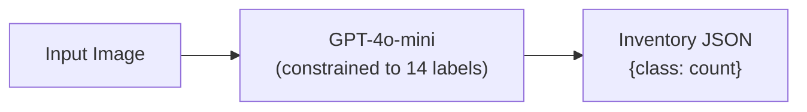
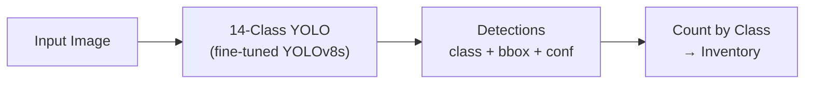
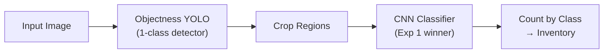
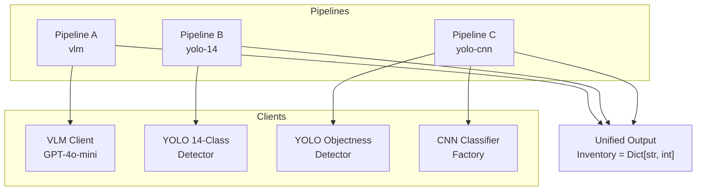
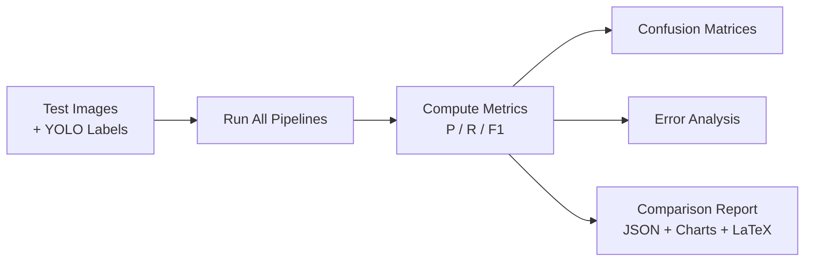
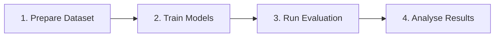

# SnapShelf — Experiment 2

**End-to-End Pipeline Comparison for 14-Class Fruit & Vegetable Inventory**

> **BSc Dissertation Artefact**
> Comparing three fundamentally different end-to-end pipelines — VLM, pure YOLO, and YOLO+CNN — for the same 14-class inventory task. This creates a clear thread: Exp 1 (best CNN) → Exp 2 (best pipeline using that CNN) → Exp 3 (integrate best pipeline into app).

## Table of Contents

1. [Research Context](#research-context)
2. [14-Class Inventory Task](#14-class-inventory-task)
3. [Pipeline Architecture](#pipeline-architecture)
4. [Experimental Design](#experimental-design)
5. [Installation](#installation)
6. [Usage](#usage)
7. [Training](#training)
8. [Evaluation](#evaluation)
9. [Output Schema](#output-schema)
10. [Configuration](#configuration)
11. [Reproducibility](#reproducibility)
12. [Project Structure](#project-structure)

## Research Context

### Problem Statement

Experiment 1 identified the best CNN architecture for single-crop fruit/vegetable classification. Experiment 2 asks the next question: **what is the best end-to-end pipeline for building a complete inventory from a single image?**

Three fundamentally different approaches are compared — a Vision-Language Model that reasons about the full image, a purpose-trained object detector that labels and counts directly, and a two-stage pipeline that separates detection from classification.

### Research Questions

1. Can a VLM (GPT-4o-mini), constrained to 14 labels, produce accurate inventories from a single image?
2. Does a purpose-trained 14-class YOLO outperform the VLM on the same task?
3. Does separating detection (objectness YOLO) from classification (CNN from Exp 1) offer advantages over either end-to-end approach?
4. What are the latency and cost trade-offs between the three strategies?

## 14-Class Inventory Task

All three pipelines solve the identical task: given an image, produce an **inventory** — a dictionary mapping class names to counts.

```python
Inventory = Dict[str, int]
# Example: {"apple": 3, "banana": 1, "tomato": 2}
```

**Classes (14):**

| # | Class | # | Class |
|:-:|-------|:-:|-------|
| 0 | `apple` | 7 | `lemon` |
| 1 | `banana` | 8 | `onion` |
| 2 | `bell_pepper_green` | 9 | `orange` |
| 3 | `bell_pepper_red` | 10 | `peach` |
| 4 | `carrot` | 11 | `potato` |
| 5 | `cucumber` | 12 | `strawberry` |
| 6 | `grape` | 13 | `tomato` |

## Pipeline Architecture

### Pipeline Overview

| Pipeline | Strategy | Flow | Models Used | LLM Calls |
|:--------:|----------|------|-------------|:---------:|
| **A** | VLM-only | Image → GPT-4o-mini → inventory | GPT-4o-mini | 1 |
| **B** | YOLO end-to-end | Image → 14-class YOLO → inventory | Custom YOLOv8 | 0 |
| **C** | YOLO + CNN | Image → objectness YOLO → crops → CNN → inventory | Objectness YOLO + CNN (Exp 1) | 0 |

**Key insight:** Pipelines B and C use **no LLM calls at all**. The comparison is VLM vs. pure detection vs. detect-then-classify.

### Pipeline A: VLM-Only



Sends the full image to GPT-4o-mini with a prompt that explicitly lists all 14 class names and instructs the model to count precisely. Unknown labels are discarded.

**Characteristics:**
- Single API call per image
- Prompt-constrained to the 14 valid classes only
- No detection or cropping — all reasoning done by the VLM
- Requires OpenAI API key

### Pipeline B: YOLO End-to-End



A YOLOv8s model fine-tuned on the 14 fruit/vegetable classes. Each detection carries a class label directly — no second-stage classification needed. The inventory is built by counting detections per class.

**Characteristics:**
- Fully offline, no API calls
- Single-model inference
- Deterministic (same image → same result)
- Requires training on labelled dataset

### Pipeline C: YOLO + CNN



A two-stage approach that separates **detection** from **classification**. An objectness YOLO (all classes remapped to a single "object" class) finds regions of interest, then the CNN winner from Experiment 1 classifies each crop.

**Characteristics:**
- Fully offline, no API calls
- Modular: swap CNN architecture via config (`efficientnet` | `resnet` | `custom`)
- Isolates detection quality from classification quality
- Requires both objectness YOLO weights and CNN weights

### System Components



| Component | File | Model |
|-----------|------|-------|
| VLM Client | `clients/vlm_client.py` | `gpt-4o-mini` |
| 14-Class YOLO | `clients/yolo_detector.py` | `weights/yolo_14class_best.pt` |
| Objectness YOLO | `clients/yolo_objectness.py` | `weights/yolo_objectness_best.pt` |
| CNN Classifier | `clients/cnn_classifier.py` | `weights/cnn_winner.pth` |

## Experimental Design

### Controlled Variables

| Aspect | Value | Rationale |
|--------|:-----:|-----------|
| YOLO Confidence | `0.25` | Balanced sensitivity for fine-tuned models |
| YOLO IoU | `0.45` | Standard NMS threshold |
| YOLO Max Detections | `30` | Allow counting in dense scenes |
| YOLO Image Size | `640` | Standard Ultralytics input |
| CNN Image Size | `224` | Standard ImageNet input |
| Crop Padding | `10%` | Context capture around detected regions |
| VLM Temperature | `0.0` | Deterministic outputs |
| Random Seed | `42` | Reproducibility across runs |

### Count-Based Metrics

Since Pipeline A has no bounding boxes, the fair comparison unit is the **inventory** (class → count). For each image, per class:

```
TP = min(predicted, ground_truth)
FP = max(0, predicted - ground_truth)
FN = max(0, ground_truth - predicted)
```

Micro-averaged across all images for overall Precision, Recall, and F1.

### Evaluation Pipeline



## Installation

### Prerequisites

- Python 3.10 or higher
- GPU recommended for training (CPU supported for inference)
- OpenAI API key (only required for Pipeline A)

### Setup

```bash
# 1. Clone repository
git clone <repository-url>
cd SnapShelf-console

# 2. Create virtual environment
python -m venv venv

# Windows
venv\Scripts\activate

# macOS/Linux
source venv/bin/activate

# 3. Install dependencies
pip install -r requirements.txt

# 4. Configure environment (only needed for Pipeline A)
# Create .env file with:
# OPENAI_API_KEY=sk-...
```

## Usage

### Command-Line Interface

```bash
# Run individual pipelines on a single image
python main.py vlm <image_path>          # Pipeline A: VLM-only
python main.py yolo-14 <image_path>      # Pipeline B: YOLO end-to-end
python main.py yolo-cnn <image_path>     # Pipeline C: YOLO + CNN

# Evaluate all pipelines on a test set
python main.py evaluate --images dataset/test/images --labels dataset/test/labels

# Train models
python main.py train yolo-14             # Train 14-class YOLO
python main.py train yolo-obj            # Train objectness YOLO

# Utility
python main.py --validate                # Verify environment and display config
```

### Interactive Mode

```bash
python main.py
```

Launches a menu-driven interface:

```
  1.  Pipeline A — VLM-only (GPT-4o-mini, 14 labels)
  2.  Pipeline B — YOLO end-to-end (14-class YOLO)
  3.  Pipeline C — YOLO + CNN (objectness YOLO + CNN)
  4.  Evaluate all pipelines on test set
  5.  Train YOLO model
  6.  Validate environment
  7.  Exit
```

### Recommended Workflow



```bash
# 1. Prepare dataset (YOLO format with 14-class labels)
#    Place in dataset/ with train/val/test splits

# 2. Prepare objectness labels (remap class IDs to 0)
python -m training.prepare_objectness_labels --src dataset --dst dataset_objectness

# 3. Train models
python main.py train yolo-14                    # 14-class YOLO → weights/yolo_14class_best.pt
python main.py train yolo-obj                   # Objectness YOLO → weights/yolo_objectness_best.pt
# (CNN weights come from Experiment 1 → weights/cnn_winner.pth)

# 4. Evaluate all available pipelines
python main.py evaluate --images dataset/test/images --labels dataset/test/labels

# 5. Results in results/
#    - comparison_summary.json
#    - comparison_bars.png
#    - comparison_table.tex
#    - per-pipeline confusion matrices and reports
```

## Training

### 14-Class YOLO (Pipeline B)

Fine-tunes YOLOv8s on the 14 fruit/vegetable classes:

```bash
python main.py train yolo-14
python main.py train yolo-14 --epochs 50 --batch 32
python -m training.train_yolo_14class --data data/yolo_14class.yaml
```

Best weights are automatically copied to `weights/yolo_14class_best.pt`.

### Objectness YOLO (Pipeline C)

Fine-tunes YOLOv8s as a 1-class objectness detector (all bounding boxes, single "object" class):

```bash
# First, prepare objectness labels
python -m training.prepare_objectness_labels --src dataset --dst dataset_objectness

# Then train
python main.py train yolo-obj
python -m training.train_yolo_objectness --data data/yolo_objectness.yaml
```

Best weights are automatically copied to `weights/yolo_objectness_best.pt`.

### CNN Classifier (Pipeline C)

The CNN classifier is provided by Experiment 1. Place the winning architecture's weights at `weights/cnn_winner.pth` and set `cnn_model_name` in `config.py` to match (`efficientnet`, `resnet`, or `custom`).

## Evaluation

### Running Evaluation

```bash
# Evaluate all available pipelines
python main.py evaluate --images dataset/test/images --labels dataset/test/labels

# Evaluate specific pipelines
python main.py evaluate --images dataset/test/images --labels dataset/test/labels --pipelines yolo-14 yolo-cnn

# Custom output directory
python main.py evaluate --images dataset/test/images --labels dataset/test/labels --output my_results/
```

### Evaluation Outputs

| File | Description |
|------|-------------|
| `comparison_summary.json` | Side-by-side P/R/F1 and latency for all pipelines |
| `comparison_bars.png` | Bar chart comparing metrics across pipelines |
| `comparison_table.tex` | LaTeX table ready for dissertation |
| `ground_truth.json` | Ground truth inventories for all test images |
| `{pipeline}_predictions.json` | Per-image predicted inventories |
| `{pipeline}_confusion.png` | Confusion matrix heatmap |
| `{pipeline}_report.json` | Full metrics, per-class breakdown, error analysis |

### Metrics

**Micro-averaged** across all test images:

| Metric | Formula |
|--------|---------|
| Precision | TP / (TP + FP) |
| Recall | TP / (TP + FN) |
| F1 | 2 × P × R / (P + R) |

Per-class metrics are also computed for detailed analysis.

## Output Schema

All pipelines produce an identical JSON structure:

```json
{
  "inventory": {
    "apple": 3,
    "banana": 1,
    "tomato": 2
  },
  "meta": {
    "pipeline": "yolo-14",
    "image": "test_001.jpg",
    "runtime_ms": 45.32,
    "detections_count": 6,
    "timing_breakdown": {
      "detection_ms": 42.15,
      "total_ms": 45.32
    }
  }
}
```

### Inventory Fields

| Field | Type | Description |
|-------|:----:|-------------|
| `inventory` | `Dict[str, int]` | Class name → count mapping |

### Metadata Fields

| Field | Type | Description |
|-------|:----:|-------------|
| `pipeline` | string | `vlm` · `yolo-14` · `yolo-cnn` |
| `image` | string | Source image filename |
| `runtime_ms` | float | Total execution time in milliseconds |
| `detections_count` | integer | Number of YOLO detections (Pipeline B/C) |
| `timing_breakdown` | object | Per-component timing |

### Timing Breakdown by Pipeline

| Field | Pipeline A | Pipeline B | Pipeline C |
|-------|:----------:|:----------:|:----------:|
| `vlm_call_ms` | VLM API time | — | — |
| `detection_ms` | — | YOLO inference | YOLO inference |
| `classification_ms` | — | — | CNN batch inference |
| `total_ms` | Total | Total | Total |

## Configuration

All experiment parameters are centralised in `config.py` as a frozen dataclass:

```python
@dataclass(frozen=True)
class ExperimentConfig:
    # VLM Settings (Pipeline A)
    vlm_model: str = "gpt-4o-mini"
    vlm_temperature: float = 0.0
    vlm_max_tokens: int = 500

    # YOLO Settings (shared by B and C)
    yolo_conf_threshold: float = 0.25
    yolo_iou_threshold: float = 0.45
    yolo_max_detections: int = 30
    yolo_img_size: int = 640

    # CNN Settings (Pipeline C)
    cnn_model_name: str = "efficientnet"  # efficientnet | resnet | custom
    cnn_img_size: int = 224
    cnn_crop_padding: float = 0.10

    # Reproducibility
    random_seed: int = 42
```

### CNN Factory Pattern

Pipeline C uses a factory pattern so the CNN architecture can be swapped without changing pipeline code:

```python
from clients.cnn_classifier import create_cnn_classifier

classifier = create_cnn_classifier()          # Uses config defaults
classifier = create_cnn_classifier("resnet")  # Override architecture

label = classifier.predict(crop)              # Single crop
labels = classifier.predict_batch(crops)      # Batch of crops
```

Available architectures: `efficientnet` (EfficientNet-B0), `resnet` (ResNet-18), `custom` (3-block CNN).

## Reproducibility

### Singleton Pattern

All model clients use a singleton pattern:
- Models load once, reused across pipeline runs
- Timing measurements exclude initialisation overhead
- Memory efficiency across multiple experiment runs

### Random Seed Control

Seeds are set automatically on experiment initialisation:
- Python `random` module
- NumPy random state
- PyTorch (CPU and CUDA)

### Structured Logging

Every experiment run generates detailed logs in `logs/experiment_{timestamp}.jsonl`:

```json
{"timestamp": "2025-01-31T15:30:45", "pipeline": "yolo-14", "step": "detection", "details": {"bbox": {...}, "confidence": 0.87, "label": "apple"}}
```

### Pinned Dependencies

Core dependencies are pinned for reproducibility:

```
ultralytics==8.3.57
openai==1.59.9
pillow==11.1.0
numpy==2.2.2
rich==13.9.4
```

Additional dependencies (torch, scikit-learn, matplotlib, seaborn, pandas) use minimum version constraints.

## Project Structure

```
SnapShelf-console/
├── config.py                         # 14-class constants, frozen ExperimentConfig, Timer, Logger
├── main.py                           # CLI: vlm / yolo-14 / yolo-cnn / evaluate / train
├── requirements.txt                  # Pinned + minimum-version dependencies
├── .gitignore                        # Excludes dataset/, weights/, runs/, results/
│
├── clients/
│   ├── __init__.py
│   ├── vlm_client.py                 # GPT-4o-mini constrained to 14 labels (Pipeline A)
│   ├── yolo_detector.py              # 14-class YOLO inference (Pipeline B)
│   ├── yolo_objectness.py            # 1-class objectness YOLO (Pipeline C)
│   └── cnn_classifier.py             # CNN factory: EfficientNet / ResNet / Custom (Pipeline C)
│
├── pipelines/
│   ├── __init__.py
│   ├── output.py                     # Inventory = Dict[str, int] schema
│   ├── vlm_pipeline.py              # Pipeline A: VLM-only
│   ├── yolo_pipeline.py             # Pipeline B: YOLO end-to-end
│   └── yolo_cnn_pipeline.py         # Pipeline C: YOLO + CNN
│
├── training/
│   ├── __init__.py
│   ├── train_yolo_14class.py         # Fine-tune YOLOv8s on 14 classes
│   ├── train_yolo_objectness.py      # Fine-tune YOLOv8s as objectness detector
│   ├── prepare_objectness_labels.py  # Remap class IDs to 0 for objectness training
│   └── data_yaml_generator.py        # Generate data.yaml for Ultralytics
│
├── evaluation/
│   ├── __init__.py
│   ├── ground_truth.py               # YOLO .txt labels → inventory dicts
│   ├── metrics.py                    # Count-based P/R/F1 (micro-averaged, per-class)
│   ├── confusion.py                  # Confusion matrix builder + heatmap plotter
│   ├── error_analysis.py             # Missed / false positive / over-under counting breakdown
│   ├── evaluate_runner.py            # Orchestrator: runs pipelines on test set
│   └── report.py                     # Comparison tables, bar charts, LaTeX output
│
├── data/
│   ├── yolo_14class.yaml             # YOLO data config (nc=14)
│   └── yolo_objectness.yaml          # YOLO data config (nc=1, class="object")
│
├── weights/                          # (gitignored) Model weights
├── results/                          # (gitignored) Evaluation outputs
└── logs/                             # (gitignored) JSONL experiment logs
```

## System Requirements

| Requirement | Specification |
|-------------|:-------------:|
| Python | 3.10+ |
| RAM | 8GB minimum (16GB recommended for training) |
| Disk | ~500MB (models + dataset) |
| GPU | Recommended for training, optional for inference |
| Network | Only for Pipeline A (OpenAI API) |

## License

This project is developed as part of a BSc dissertation.

## Acknowledgements

- [Ultralytics](https://github.com/ultralytics/ultralytics) for YOLOv8
- [OpenAI](https://openai.com) for GPT-4o Vision API
- [PyTorch](https://pytorch.org) for CNN training and inference
